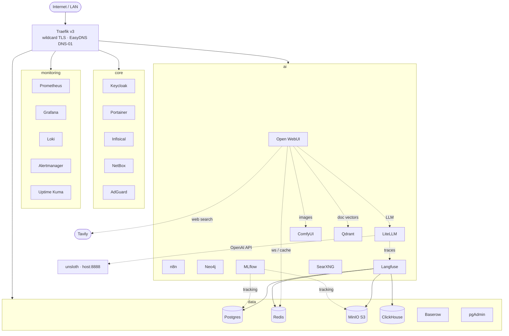

# ai-homelab-infra

Unified, production-style **homelab stack** for the server **`jarvis`** — reverse proxy,
identity, data services, full observability, and a GPU-accelerated AI/automation suite,
all defined as modular Docker Compose and fronted by Traefik with automatic wildcard TLS.


> **Status:** Operational on `jarvis` — last verified **2026-06-15**. 36 containers running,
> 22/22 web routes responding behind the wildcard cert, GPU passthrough confirmed,
> Open WebUI wired to a local unsloth LLM + ComfyUI.

---

## Architecture



- **One reverse proxy, one cert.** Traefik issues a single Let's Encrypt **wildcard**
  (`*.pdx.sanctioned.tech`) via the EasyDNS DNS-01 challenge — every service inherits TLS
  with no per-service cert config and no public port-80 requirement.
- **Modular but unified.** Four per-layer compose files (`core` / `data` / `monitoring` /
  `ai`) combined by a root [`docker/compose.yml`](docker/compose.yml) via Compose `include:` —
  bring the whole lab up with one command or cycle a single layer.
- **Segmented networks.** An external `proxy` edge network plus `data` / `ai` / `monitoring`
  segments; services join only what they need.
- **Secure by construction.** Hardened middleware chain (HSTS, security headers, rate-limit,
  compression), Docker secrets for the ACME DNS API, aligned credentials from a single `.env`.

## Services

All web services are at `https://<name>.pdx.sanctioned.tech`. **Auth** legend:
🔑 Keycloak OIDC · 🛡️ Keycloak forward-auth · 🔒 local login · 🎟️ token/API-key ·
🔓 none · 🧰 break-glass basic-auth.

| Service | URL | Purpose | Auth |
|---------|-----|---------|------|
| **Traefik** | `traefik.…/dashboard/` | Reverse proxy, wildcard TLS, routing | 🛡️ |
| **Keycloak** | `keycloak.…` | Identity provider (SSO) | 🔒 (is the IdP) |
| **Portainer** | `portainer.…` | Docker management UI | 🔑 OAuth |
| **Infisical** | `infisical.…` | Secrets management | 🔒 |
| **NetBox** | `netbox.…` | IPAM / DCIM | 🔒 |
| **AdGuard** | `adguard.…` | Network DNS + ad-blocking | 🔒 |
| **MinIO** | `minio.…` / `s3.…` | S3 object storage (console / API) | 🔒 |
| **ClickHouse** | `clickhouse.…` | OLAP DB (Langfuse analytics backend) | 🔒 |
| **Baserow** | `baserow.…` | No-code database | 🔒 |
| **pgAdmin** | `pgadmin.…` | Postgres admin UI | 🔒 |
| **Grafana** | `grafana.…` | Metrics dashboards | 🔑 OIDC |
| **Prometheus** | `prometheus.…` | Metrics collection | 🛡️ |
| **Alertmanager** | `alertmanager.…` | Alert routing | 🛡️ |
| **Uptime Kuma** | `uptime.…` | Uptime / status monitoring | 🔒 |
| **Open WebUI** | `openwebui.…` | LLM chat (→ unsloth + ComfyUI), Tavily web search, Qdrant RAG | 🔑 OIDC |
| **LiteLLM** | `litellm.…` | LLM gateway → unsloth, auto-traces to Langfuse | 🎟️ master key |
| **n8n** | `n8n.…` | Workflow automation | 🔒 (OIDC = paid) |
| **ComfyUI** | `comfyui.…` | Image generation (GPU) | 🛡️ |
| **Jupyter** | `jupyter.…` | Notebooks | 🎟️ token |
| **Flowise** | `flowise.…` | LLM workflow builder | 🔒 (OIDC = paid) |
| **Qdrant** | `qdrant.…` | Vector database (backs Open WebUI document/Knowledge RAG) | 🎟️ API key |
| **Neo4j** | `neo4j.…` | Graph database | 🔒 |
| **SearXNG** | `searxng.…` | Privacy meta-search (self-hosted web-search fallback) | 🛡️ |
| **Langfuse** | `langfuse.…` | LLM observability/tracing | 🔑 OIDC |
| **MLflow** | `mlflow.…` | ML experiment tracking + model registry | 🛡️ (UI) |
| **Wyoming Piper/Whisper** | `tcp :10200/:10300` | TTS / STT (GPU, Wyoming protocol) | 🔓 |
| *Postgres · Redis* | internal | Unified DB / cache (no UI) | — |
| *Firezone* | *deferred* | VPN (EOL image; replacing) | — |

**AI integrations:** Open WebUI → local **unsloth** (llama.cpp, OpenAI-compatible, `Qwen3.5-4B`)
on the host via the **LiteLLM** gateway (every call traced to **Langfuse**), → **ComfyUI** for
image generation, → **Tavily** for web search, and → **Qdrant** for document/Knowledge RAG, with
**Redis** as the websocket manager / cache.

## Repository layout

```
docker/
├── compose.yml              # root — includes the four layer files
├── .env.example             # credential template (real .env is host-local, gitignored)
├── secrets/                 # EasyDNS API token/key (gitignored) — see secrets/README.md
├── core/        compose.core.yml        + traefik/ keycloak/ … configs
├── data/        compose.data.yml        + postgres/init, clickhouse/keeper, …
├── monitoring/  compose.monitoring.yml  + prometheus/ grafana/ loki/ … configs
└── ai/          compose.ai.yml          + searxng/ … configs
kubernetes/                  # reserved for a future migration
```

See **[docker/README.md](docker/README.md)** for the full deploy/runbook (networks, secrets,
EasyDNS, and the jarvis bring-up sequence).

## Deploy (summary)

```bash
docker context use jarvis
for n in proxy data ai monitoring; do docker network create "$n"; done
# Secrets come from Infisical — pull them into .env (needs .infisical-auth bootstrap):
cd /opt/homelab && ./pull-secrets.sh        # or, first-ever bootstrap: cp .env.example .env
docker compose -f compose.yml up -d postgres redis minio minio-init clickhouse
docker compose -f compose.yml up -d
docker compose -f compose.yml logs -f traefik   # watch wildcard cert issuance
```

> Secrets are managed in **Infisical** (project `homelab`, env `prod`); `.env` is a generated
> artifact. See [docker/core/infisical/README.md](docker/core/infisical/README.md) for the
> bootstrap set + rebuild runbook.

## Roadmap

- [x] Consolidate legacy compose files into a unified modular stack
- [x] Traefik v3 + EasyDNS DNS-01 wildcard TLS
- [x] Deploy & verify all four layers on jarvis (GPU included)
- [x] Open WebUI ↔ unsloth + ComfyUI integration
- [x] EdgeRouter internal DNS for all service hostnames
- [x] **Keycloak SSO** — `homelab` realm; native OIDC (Grafana, Open WebUI, Portainer,
      Langfuse) + `traefik-forward-auth` gating the no-auth services
- [ ] VPN for external access (NetBird — WireGuard + Keycloak SSO)
- [x] **Secrets in Infisical** — all secrets in the `homelab` project; deploys pull via
      `pull-secrets.sh`; `.env` is a generated artifact (bootstrap set kept out-of-band)
- [x] **Backups** — nightly `pg_dumpall` (all DBs incl. Infisical's encrypted store) →
      local (rotated) + MinIO, via `backup.sh` cron. *(ClickHouse, MinIO object data, and
      off-host replication still TODO.)*
- [ ] Hardening (rotate defaults, restrict remaining surfaces) + off-host backup replication
- [ ] Optional Kubernetes migration (`kubernetes/`)

## Known / deferred

- **Firezone** deferred — the 0.7 image is EOL; replacing with a modern SSO-integrated VPN.
- **n8n / Flowise** gate OIDC behind paid tiers; **NetBox** needs a remote-auth plugin —
  these keep local logins (can be forward-auth gated later). Traefik dashboard stays on
  basic-auth as a break-glass.
- `clickhouse-exporter` removed (unmaintained image) — pending ClickHouse-native metrics.

## License

MIT
