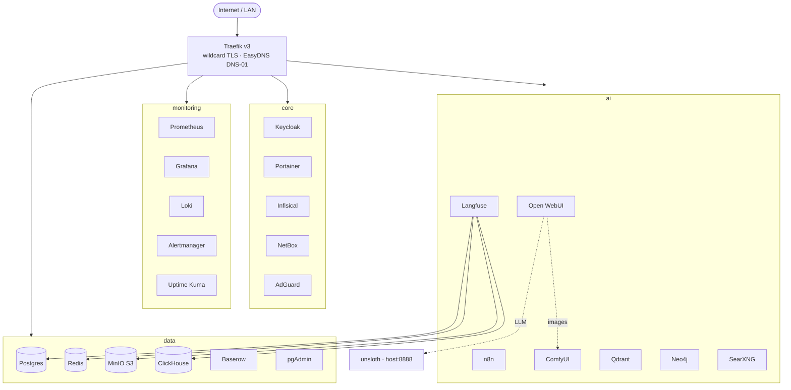

# ai-homelab-infra

Unified, production-style **homelab stack** for the server **`jarvis`** — reverse proxy,
identity, data services, full observability, and a GPU-accelerated AI/automation suite,
all defined as modular Docker Compose and fronted by Traefik with automatic wildcard TLS.


> **Status:** Operational on `jarvis` — last verified **2026-06-15**. 36 containers running,
> 22/22 web routes responding behind the wildcard cert, GPU passthrough confirmed,
> Open WebUI wired to a local unsloth LLM + ComfyUI.

---

## Architecture



- **One reverse proxy, one cert.** Traefik issues a single Let's Encrypt **wildcard**
  (`*.pdx.sanctioned.tech`) via the EasyDNS DNS-01 challenge — every service inherits TLS
  with no per-service cert config and no public port-80 requirement.
- **Modular but unified.** Four per-layer compose files (`core` / `data` / `monitoring` /
  `ai`) combined by a root [`docker/compose.yml`](docker/compose.yml) via Compose `include:` —
  bring the whole lab up with one command or cycle a single layer.
- **Segmented networks.** An external `proxy` edge network plus `data` / `ai` / `monitoring`
  segments; services join only what they need.
- **Secure by construction.** Hardened middleware chain (HSTS, security headers, rate-limit,
  compression), Docker secrets for the ACME DNS API, aligned credentials from a single `.env`.

## Service inventory

| Stack | Services |
|-------|----------|
| **core** | Traefik · Keycloak · Portainer · Infisical · NetBox · AdGuard · *(Firezone — deferred)* |
| **data** | Postgres 16 (per-service DBs) · Redis · MinIO (S3 + bucket) · ClickHouse (+ Keeper) · Baserow · pgAdmin |
| **monitoring** | Prometheus · Grafana · Loki · Promtail · Alertmanager · cAdvisor · node/blackbox/postgres/adguard exporters · Watchtower · Uptime Kuma |
| **ai** | Open WebUI · n8n · ComfyUI (GPU) · Wyoming TTS/STT (GPU) · Jupyter · Flowise · Qdrant · Neo4j · SearXNG · Langfuse (web + worker) |

**AI integrations:** Open WebUI → local **unsloth** (llama.cpp, OpenAI-compatible, `Qwen3.5-4B`)
on the host, and → **ComfyUI** for image generation.

## Repository layout

```
docker/
├── compose.yml              # root — includes the four layer files
├── .env.example             # credential template (real .env is host-local, gitignored)
├── secrets/                 # EasyDNS API token/key (gitignored) — see secrets/README.md
├── core/        compose.core.yml        + traefik/ keycloak/ … configs
├── data/        compose.data.yml        + postgres/init, clickhouse/keeper, …
├── monitoring/  compose.monitoring.yml  + prometheus/ grafana/ loki/ … configs
└── ai/          compose.ai.yml          + searxng/ … configs
kubernetes/                  # reserved for a future migration
```

See **[docker/README.md](docker/README.md)** for the full deploy/runbook (networks, secrets,
EasyDNS, and the jarvis bring-up sequence).

## Deploy (summary)

```bash
docker context use jarvis
for n in proxy data ai monitoring; do docker network create "$n"; done
cp docker/.env.example docker/.env        # fill in; add docker/secrets/easydns_{token,key}
docker compose -f docker/compose.yml up -d postgres redis minio minio-init clickhouse
docker compose -f docker/compose.yml up -d
docker compose -f docker/compose.yml logs -f traefik   # watch wildcard cert issuance
```

## Roadmap

- [x] Consolidate legacy compose files into a unified modular stack
- [x] Traefik v3 + EasyDNS DNS-01 wildcard TLS
- [x] Deploy & verify all four layers on jarvis (GPU included)
- [x] Open WebUI ↔ unsloth + ComfyUI integration
- [ ] EdgeRouter internal DNS for all service hostnames
- [ ] **Keycloak SSO wiring** — OIDC clients + forward-auth for no-auth services *(deployed, not yet wired)*
- [ ] VPN for external access (NetBird — WireGuard + Keycloak SSO)
- [ ] Hardening (rotate defaults, restrict open services) + backups
- [ ] Migrate secrets into Infisical
- [ ] Optional Kubernetes migration (`kubernetes/`)

## Known / deferred

- **Firezone** deferred — the 0.7 image is EOL; replacing with a modern SSO-integrated VPN.
- **AdGuard** needs its first-run setup wizard (`:3000`) before it serves the web UI.
- **SSO is deployed but not yet enforced** — services currently use local auth or none.
- `clickhouse-exporter` removed (unmaintained image) — pending ClickHouse-native metrics.

## License

MIT
