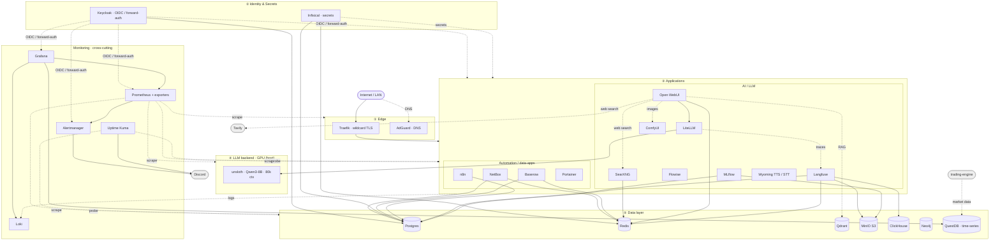

# ai-homelab-infra

Unified, production-style **homelab stack** for the server **`jarvis`** — reverse proxy,
identity, data services, full observability, and a GPU-accelerated AI/automation suite,
all defined as modular Docker Compose and fronted by Traefik with automatic wildcard TLS.


> **Status:** Operational on `jarvis` — last verified **2026-06-16**. 40 containers, 26 web
> routes behind the wildcard cert, GPU passthrough confirmed, Open WebUI wired to a local
> unsloth LLM + ComfyUI. **All images pinned to stable/secure versions** (audited for CVEs/EOL;
> no mutable `:latest`/`:main` tags). Metric alerting → Discord is live.

---

## Architecture

Read it **bottom-up**: every application persists to the shared **data layer**, sits behind
**identity** and the **edge** proxy, and is observed by the **cross-cutting monitoring** stack.
Solid arrows are hard runtime dependencies (won't start / function without); dotted arrows are
request-time calls. External services are grey.



- **One reverse proxy, one cert.** Traefik issues a single Let's Encrypt **wildcard**
  (`*.pdx.sanctioned.tech`) via the EasyDNS DNS-01 challenge — every service inherits TLS
  with no per-service cert config and no public port-80 requirement.
- **Modular but unified.** Four per-layer compose files (`core` / `data` / `monitoring` /
  `ai`) combined by a root [`docker/compose.yml`](docker/compose.yml) via Compose `include:` —
  bring the whole lab up with one command or cycle a single layer.
- **Segmented networks.** An external `proxy` edge network plus `data` / `ai` / `monitoring`
  segments; services join only what they need.
- **Pinned & secure by construction.** Every image pinned to an audited stable version,
  hardened middleware chain (HSTS, security headers, rate-limit, compression), Docker secrets
  for the ACME DNS API, and all credentials sourced from Infisical.

## Services

All web services are at `https://<name>.pdx.sanctioned.tech`. **Auth** legend:
🔑 Keycloak OIDC · 🛡️ Keycloak forward-auth · 🔒 local login · 🎟️ token/API-key ·
🔓 none · 🧰 break-glass basic-auth.

| Service | URL | Purpose | Auth |
|---------|-----|---------|------|
| **Traefik** | `traefik.…/dashboard/` | Reverse proxy, wildcard TLS, routing | 🛡️ / 🧰 |
| **Keycloak** | `keycloak.…` | Identity provider (SSO) | 🔒 (is the IdP) |
| **Infisical** | `infisical.…` | Secrets — source of truth | 🔒 |
| **Portainer** | `portainer.…` | Docker management UI | 🔑 OAuth |
| **NetBox** | `netbox.…` | IPAM / DCIM | 🔒 |
| **AdGuard** | `adguard.…` | Network DNS + ad-blocking | 🔒 |
| **Postgres** | internal | Unified relational DB (per-service DBs) | — |
| **Redis** | internal | Shared cache / queues (per-service DBs) | — |
| **MinIO** | `minio.…` / `s3.…` | S3 object storage (console / API) | 🔒 |
| **ClickHouse** | `clickhouse.…` | OLAP DB (Langfuse backend); native Prom metrics | 🔒 |
| **QuestDB** | `questdb.…` | Time-series DB — market/trading data (PG-wire) | 🛡️ console · 🎟️ PG-wire |
| **Neo4j** | `neo4j.…` | Graph database | 🔒 |
| **Baserow** | `baserow.…` | No-code database + REST API | 🔒 |
| **pgAdmin** | `pgadmin.…` | Postgres admin UI | 🔒 |
| **Grafana** | `grafana.…` | Metrics dashboards | 🔑 OIDC |
| **Prometheus** | `prometheus.…` | Metrics collection + alert rules | 🛡️ |
| **Alertmanager** | `alertmanager.…` | Alert routing → Discord | 🛡️ |
| **Uptime Kuma** | `uptime.…` | Uptime / status monitoring (→ Discord) | 🛡️ |
| **Open WebUI** | `openwebui.…` | LLM chat (→ unsloth + ComfyUI), Tavily search, Qdrant RAG | 🔑 OIDC |
| **LiteLLM** | `litellm.…` | LLM gateway → unsloth, auto-traces to Langfuse | 🎟️ master key |
| **ComfyUI** | `comfyui.…` | Image generation (GPU) | 🛡️ |
| **SearXNG** | `searxng.…` | Privacy meta-search (web-search fallback) | 🛡️ |
| **Flowise** | `flowise.…` | LLM workflow builder | 🔒 (OIDC = paid) |
| **n8n** | `n8n.…` | Workflow automation | 🔒 (OIDC = paid) |
| **Langfuse** | `langfuse.…` | LLM observability / tracing | 🔑 OIDC |
| **MLflow** | `mlflow.…` | ML experiment tracking + model registry | 🛡️ (UI) |
| **Qdrant** | `qdrant.…` | Vector DB (backs Open WebUI document/Knowledge RAG) | 🎟️ API key |
| **Wyoming Piper/Whisper** | `tcp :10200 / :10300` | TTS / STT (GPU, Wyoming protocol) | 🔓 LAN |

**AI integrations:** Open WebUI → local **unsloth** (llama.cpp, OpenAI-compatible, `Qwen3-8B`,
80k ctx) on the host via the **LiteLLM** gateway (every call traced to **Langfuse**), → **ComfyUI**
for image generation, → **Tavily** for web search (results injected into the 80k context),
and **Qdrant** for document/Knowledge RAG, with **Redis** as the websocket manager / cache.

## Repository layout

```
docker/
├── compose.yml              # root — includes the four layer files
├── .env.example             # credential template (real .env is host-local, gitignored)
├── secrets/                 # EasyDNS API token/key (gitignored) — see secrets/README.md
├── core/        compose.core.yml        + traefik/ keycloak/ infisical/ netbox/ adguard/ …
├── data/        compose.data.yml        + postgres/init, clickhouse/, questdb/, minio/ …
├── monitoring/  compose.monitoring.yml  + prometheus/ grafana/ loki/ alertmanager/ …
└── ai/          compose.ai.yml          + openwebui/ litellm/ comfyui/ langfuse/ searxng/ …
host/                        # host-level (non-Docker) services
├── unsloth/                 # unsloth LLM systemd unit + override (80k context, q8 KV)
└── wireguard/               # EdgeRouter WireGuard VPN — topology, peers, EdgeOS config, gotchas
kubernetes/                  # reserved for a future migration
```

See **[docker/README.md](docker/README.md)** for the full deploy/runbook (networks, secrets,
EasyDNS, and the jarvis bring-up sequence).

## Deploy (summary)

```bash
docker context use jarvis
for n in proxy data ai monitoring; do docker network create "$n"; done
# Secrets come from Infisical — pull them into .env (needs .infisical-auth bootstrap):
cd /opt/homelab && ./pull-secrets.sh        # or, first-ever bootstrap: cp .env.example .env
docker compose -f compose.yml up -d postgres redis minio minio-init clickhouse
docker compose -f compose.yml up -d
docker compose -f compose.yml logs -f traefik   # watch wildcard cert issuance
```

> Secrets are managed in **Infisical** (project `homelab`, env `prod`); `.env` is a generated
> artifact. See [docker/core/infisical/README.md](docker/core/infisical/README.md) for the
> bootstrap set + rebuild runbook.

## Roadmap

- [x] Consolidate legacy compose files into a unified modular stack
- [x] Traefik v3 + EasyDNS DNS-01 wildcard TLS
- [x] Deploy & verify all four layers on jarvis (GPU included)
- [x] Open WebUI ↔ unsloth + ComfyUI integration
- [x] EdgeRouter internal DNS for all service hostnames
- [x] **Keycloak SSO** — `homelab` realm; native OIDC (Grafana, Open WebUI, Portainer,
      Langfuse) + **oauth2-proxy** forward-auth gating the no-auth services (Prometheus, ComfyUI, …)
- [x] **Observability** — Uptime Kuma (28 monitors + Discord), Promtail→Loki (Docker SD), and
      provisioned Grafana dashboards (host/GPU, GPU, service traffic, containers, Postgres,
      Redis, ClickHouse) + a QuestDB datasource. ClickHouse & QuestDB expose native Prometheus
      metrics.
- [x] **Metric alerting → Discord** — Prometheus rules + Alertmanager dispatch: GPU/CPU
      temperature, disk usage, host-memory pressure, container OOM-kills / restart-loops,
      Postgres connections, Redis memory (see [docker/monitoring/alertmanager/](docker/monitoring/alertmanager/README.md))
- [x] **VPN** — WireGuard on the EdgeRouter (4 peers, split-tunnel to the home LANs, internal
      DNS over the tunnel; EasyDNS DDNS for the dynamic WAN). See [host/wireguard/](host/wireguard/README.md)
- [x] **Secrets in Infisical** — all secrets in the `homelab` project; deploys pull via
      `pull-secrets.sh`; `.env` is a generated artifact (bootstrap kept out-of-band)
- [x] **Backups** — nightly `backup.sh` cron snapshots every datastore, each online-consistent:
      Postgres `pg_dumpall`, ClickHouse native `BACKUP`, QuestDB `CHECKPOINT`, MinIO object store
      → local (rotated) + MinIO, **plus an off-host encrypted replica to the Asustor NAS** via
      restic to an append-only REST server (client-side encrypted, deduplicated, tamper-resistant)
      — see [docs/off-host-backup.md](docs/off-host-backup.md).
- [x] **Images pinned (pre-dev hardening)** — audited all ~40 images (CVE/EOL via live
      registries) and pinned to stable/secure versions; mutable `:latest`/`:main` removed
- [x] Migrated `traefik-forward-auth` → **oauth2-proxy** (Keycloak OIDC, central auth domain
      `auth.${DOMAIN}`, Redis-backed sessions) — the archived image is gone
- [x] Hardening — strong creds verified; QuestDB PG-wire/ILP pulled off the LAN (internal-only)
- [x] **Off-host backup replication** — restic → append-only REST server on the Asustor NAS
      (`stor.pdx.sanctioned.tech`); wired into the nightly `backup.sh`. See [docs/off-host-backup.md](docs/off-host-backup.md)
- [ ] Optional Kubernetes migration (`kubernetes/`)

## Known / deferred

- **Removed:** Firezone (0.7 EOL → WireGuard on the EdgeRouter), cadvisor (→ Telegraf's Docker
  input), **Watchtower** (archived; auto-updates conflict with pinned images), and **Jupyter**
  (dropped). comfyui moved off the unmaintained ai-dock build to `mmartial/comfyui-nvidia-docker`.
- **Forward-auth is now oauth2-proxy** (Keycloak OIDC, `homelab` realm), replacing the archived
  `thomseddon/traefik-forward-auth`. Central auth domain `auth.${DOMAIN}`, Redis-backed sessions,
  a single `/oauth2/callback` redirect URI, and `--cookie-csrf-per-request` (see Known issues).
- **n8n / Flowise** gate OIDC behind paid tiers; **NetBox** needs a remote-auth plugin — these
  keep local logins (can be forward-auth gated later). Traefik dashboard keeps break-glass basic-auth.

## License

MIT
